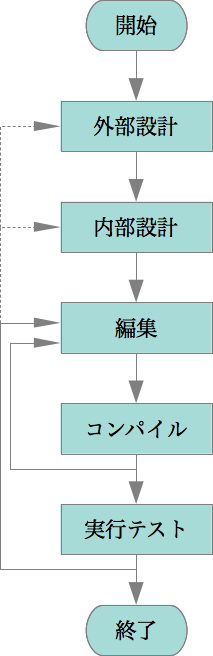
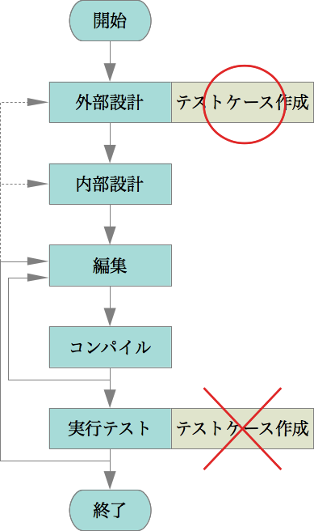
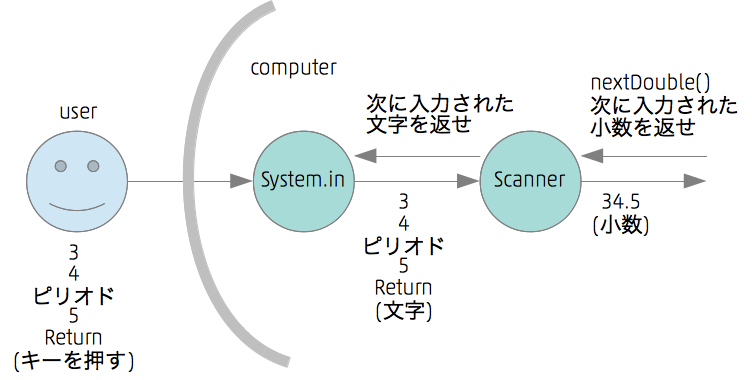

# 第１回 プログラミングとは何か
## 今回の目標
* プログラミングとはどういう活動なのか、他の人に説明できるようになる。

----

## プログラムとプログラミング

* プログラム　＝　料理のレシピ
* プログラムを実行する　＝　レシピに従って料理を作る
* プログラミング　＝　新しいレシピを考えて書くこと

## プログラミングの流れ
* **［ステップ1. 外部設計］** 何を作るか考える (what)
 ― 外から（使う人から）見る ー 外部仕様を考える
* **［ステップ2. 内部設計］** どのように作るか考える (how)
 ー 中から（作る人から）見る ー 内部仕様を考える
* **［ステップ3. 編集］** emacs: ソースファイルを作る ー テキストエディタ(emacs)を使う
* **［ステップ4. コンパイル］** コンパイルする ー javacコマンドを使う
    * コンパイルエラーが出たら3に戻って修正
* **［ステップ5. 実行テスト］** 実行してテストする ー javaコマンドを使う
    * テストに失敗したら3に戻って修正（さらに2や1にまで戻る場合もある）

```note
実社会のソフトウェア開発では、この後に**保守**の作業があり、それが大問題だけど、プログラミングからは少し外れる部分もあるので、ここでは省略
```

----

### プログラミングの流れ図



----

### 料理のたとえで言うと…

* **［ステップ1. 外部設計］** どんな料理を作るか考える  
 ― 外から（食べる人から）見る ー 外部仕様を考える
* **［ステップ2. 内部設計］** どのように料理を作るか考える  
 ー 中から（作る人から）見る ー 内部仕様を考える
* **［ステップ3. 編集］** レシピを書く ー ワープロを使う
* ~~**［ステップ4. コンパイル］** コンパイルする~~ （料理ではコンパイルはない）
* **［ステップ5. 実行テスト］** 実際に料理を作り、試食する
    * テストに失敗したら（おいしくなかったら）3に戻って修正（さらに2や1にまで戻る場合もある）

```note
厳密に考えると、プログラムを使う人と料理を食べる人は少し違う。

コンパイルが何をするのかについては、次回以降に説明する。
```

----

## プログラミングの例1（hello, world）

* **［ステップ1. 外部設計］**、**［ステップ2. 内部設計］**の部分がとても重要
* しかし、説明が長くなるので後回しにして、その部分が必要ないプログラムを例に、**［ステップ3. 編集］**、**［ステップ4. コンパイル］**、**［ステップ5. 実行テスト］** を先に説明する。
* プログラミング言語の入門書で最初の例題は**hello, world**が定番。ここでも伝統に従う。
* 実行すると`hello, world`とプリントするだけのプログラム

----

### Hello.java

```{.java}
(> ../workspace/01/src/Hello.java <)
```
<!--
public class Hello {
    public static void main(String[] args) {
        System.out.println("hello, world");
    }
}
-->

----

### プログラミング言語

* プログラムは**プログラミング言語**と呼ばれる人工的な言語を使って書く。
* プログラミング言語は１種類ではない。いろいろな言語が存在する。
    * それぞれ特徴があり、用途の向き不向きがある。
    * 流行り廃りもある。好き嫌いもある。
* でも、この科目のように基礎的な部分では、どの言語を使っても大差ない。
* この授業では**Java**という言語を使う。
* 個人的にはそろそろPythonにした方がよいかなとも思っているが…

参考：Phthonのhello, world　とてもシンプル

```{.python}
print "hello, world"
```

----

### 開発環境

* プログラムを開発する（作る）際の環境を**開発環境**という。
* 開発環境もいろいろある。同じJava言語でもいろいろな環境で開発できる。
* 基礎的な（不便な）開発環境　⇔　高度な（便利な）開発環境
* この授業では基礎的な開発環境を使う。その方が仕組みが理解しやすいから。
* ただし、不便なので、２年生になったら便利な（開発効率がよい）開発環境を使う
* 高度な開発環境は、**IDE（統合開発環境）**と呼ばれ、GUIで操作するのが普通
* この授業では、GUIではなく、キーボードからコマンドを入力する開発環境を使う

----

### ソースファイル

* コンピュータでは**ファイル**に情報を記録する（記憶させる）
* プログラムの文字の列を入れたファイルを**ソースファイル**と呼ぶ
* ソースファイルは文字だけが入っているファイル（**プレーンテキストファイル**）
    * ワープロのファイルは文字だけではなく、色の指定や画像も入っているのでプレーンテキストファイルではない
* ファイルにはファイルの名前（**ファイル名**）が付いている
* ソースファイルの名前の付け方には決まりがある
    * Javaのソースファイルには、`Hello.java`のような名前を付ける
    * 後半の部分（拡張子）の`.java`は必ず`.java`にする
    * 前半の部分は、通常、プログラムの名前（正確にはクラスの名前）と同じにする

----

### ［ステップ3. 編集］

* ソースファイルを作る方法はいろいろあるが、ここではテキストエディタを使う
* テキストエディタはプレーンテキストファイルを作るための道具
* ワープロと似ている
* テキストエディタにもいろいろなテキストエディタがあるが、ここではemacsを使う

----

### ［ステップ4. コンパイル］

* コンパイルは、人間向きのプログラミング言語（高級言語）をコンピュータ向きの言語に変換（翻訳）する作業（詳しくは後日）
* コンパイルを行う道具をコンパイラと言う
* Java言語のコンパイラのコマンドはjavac
* `javac ソースファイル名`でコンパイルできる
    * ソースファイル名が`Hello.java`なら、`javac Hello.java`

----

### ［ステップ5. 実行テスト］

* コンパイルしたJavaプログラムを実行するには`java`コマンドを使う
* `java クラス名`で実行できる
    * クラス名が`Hello`なら、`java Hello`
* ソースファイル名とクラス名は、ソースファイル名には`.java`が付いていて、クラス名には付いていない点が違うが、前半（`Hello`の部分）は同じにするのが普通。
* 実行したら、正しく動作しているかどうかテストする
    * `hello, world`プログラムの場合、`hello, world`と正しく表示されるかどうかを確認する 

----

## テスト駆動開発、テストファースト

* 何を作るか考えるときに、テストケースを考えておく。
* テストケース＝こういう入力を与えたら、こういう出力を返さないといけない
* ソースコードを作る前にテストケースを先に作る＝テストファースト

----

### テストファースト



----

### リファクタリング
* 全部のテストに合格すれば、一応、正しい（外部仕様を満たした）プログラムになる。しかし、そこで終わりにせずに、`リファクタリング`を行う。
* リファクタリング＝テストに合格した状態を保ちながら、ソースコード（内部設計）をより良い状態に書き換えること
* 中を書き換えると動かなくなる可能性があるので、一度、動いてしまうと書き換える勇気がなくなる。一番怖いのは、動かなくなっているのに、それに気付かないこと。しかし、テストケースが作ってあれば、動かなくなってもすぐにわかるので、書き換える勇気が出る。
* テストは自動化する。少しリファクタリングするたびに、自動的にテストを実行し、常に正しく動いている状態を維持する。（この科目では自動化せず手作業）

----

## プログラミングの例2（肥満診断）

> 例題：肥満診断 ー 肥満かどうかを診断するプログラムを作ってみる

----

### ［ステップ1. 外部仕様］何を作るか考える（What）＋テストケースを作る

----

#### いろいろな可能性を検討する（発散段階）

##### 何を入力して診断するか？

* スマフォのカメラで撮影する　＝　画像（写真）が入力
* 体重計で計る　＝　体重の数値が自動的に入力される
* 体重の数値をユーザが入力する　＝　マウスで？　キーボードから？

体重だけで十分か？身長、腹囲、体脂肪は？  
（本当は十分ではないが、今日は体重だけで判断する）

体重は小数？

----

##### 診断結果は何か？

* 肥満　（肥満でない時には何も結果がない）
* 肥満、肥満でない
* 肥満、痩身
* 肥満、標準、痩身
* 肥満、やや肥満、標準、やや痩身、痩身

----

##### 診断結果をどうやって伝えるか？

* 文字で
* 図で
* イメージ写真で
* ビデオで
* 音で、音楽で

----

#### 仕様を決める（収束段階）

* プログラミングの初心者なので、なるべく簡単な方法にするべき

なので、仕様は次のように決める

* 入力:ユーザがキーボードから体重の数値を小数で入力する
* 出力:診断結果は「肥満」「肥満でない」のどちらかが文字で表示される

----

#### テストケースを考える
* 何 kgを入力したら、「肥満」という文字が表示されるか
* 何 kgを入力したら、「肥満ではない」という文字が表示されるか

あらゆる体重を考えるのは無理。
代表的な値や際どい値（境界の値）のテストケースを考える。

代表的な値のテストケース

    100 kgを入力する → 「肥満」という診断結果が出力される
    30 kgを入力する → 「肥満ではない」という診断結果が出力される

際どい値（境界値）のテストケース

    80 kgを入力する → 「肥満」という診断結果が出力される
    79.9 kgを入力する → 「肥満ではない」という診断結果が出力される

----

### ［ステップ2. 内部仕様] どのように作るか考える(How)

----

#### オブジェクト

* Javaはオブジェクト指向言語
* オブジェクトの説明は、後期の「オブジェクト指向I」で行う
* でも、単語だけは前期から使う
* とりあえず、オブジェクトは何かある仕事をしてくれる「もの」
* 擬人化して、何かある仕事をしてくれる「ひと」と考えてもよい。

----

#### 体重の値（小数）を入力するにはどうすればよいか

* ユーザがコンピュータのキーボードのキーを押して文字を入力しようとする
    * 34.5kgを入力したければ、3、4、ピリオド、5、Returnのキーを押す 
* プログラムは、ユーザが入力した文字を読む必要がある
* ユーザが入力した文字を読むという仕事をしてくれるオブジェクトが用意されている
* そのオブジェクトは`System.in`
* `System.in`にお願いすると、ユーザが入力した文字が読める

----

* `System.in`は文字を読んでくれるが、それはあくまで文字
* このプログラムでは、小数（体重の値）が欲しい
    * 3、4、ピリオド、5、Returnという文字の列を34.5という小数に直さないといけない
* 文字を小数に直す仕事をしてくれるのが`Scanner`オブジェクト

----

* `System.in`オブジェクトは自動的に用意されていたが、`Scanner`オブジェクトは自分で作らないといけない
* オブジェクトを作るのは`new`
* 作ったオブジェクトは、後で使うために`変数`に入れておく
* 変数の名前は自分で考える。作ったオブジェクトに名前を付けるイメージ

```{.note}
変数の詳細は後日
```

----

* Scannerオブジェクトに「小数の値を読みたい」とお願いすると、ユーザが入力した文字を小数に直したものを返してくれる。
* 読んだ小数の値も、後で使うために`変数`に入れておく

----

##### プログラムにする

以上の長い話をJavaのプログラムで書くと次のようになる。

```{.java}
Scanner keyboard = new Scanner(System.in);
double weight = keyboard.nextDouble();
```

----

#### Scannerオブジェクトを作る部分

```{.java}
Scanner keyboard = new Scanner(System.in);
```

* `new Scanner(System.in)`で、`System.in`オブジェクトからユーザが入力した文字を読んで、それを小数などに直してくれるScannerオブジェクトを作る
* 作ったオブジェクトを`keyboard`という名前の変数に入れる（keyboardという名前を付けるイメージ）

----

##### 作ったScannerオブジェクトから小数を入力する部分

```{.java}
double weight = keyboard.nextDouble();
```

* keyboardオブジェクト（keyboardという名前のScannerオブジェクト）に「次の小数の値を読みたい」とお願いする
* `nextDouble()`がそのお願い。これで、ユーザが入力した小数の値が取り出せる。
* `double`は倍精度小数の意味。倍＝double
* 読んだ小数の値は`weight`という名前の変数に入れる

----

##### System.inとScannerの関係



----

##### 自分で決められる名前と決められない名前

* keyboardとweightは自分で考えた名前なので、嫌なら別な名前にすることも可能
* その他の名前は、すでに決まった名前なので、変更できない。

次の２つは、変数の名前は違うけど同じ動作をする

```{.java}
Scanner keyboard = new Scanner(System.in);
double weight = keyboard.nextDouble();
```

少し短い名前にしたもの

```{.java}
Scanner in = new Scanner(System.in);
double w = in.nextDouble();
```

----

##### 名前について

* 名前を決める時には、内容がわかる、意味のある名前にする
* 体重の値が入る変数にはweightは適切
    * 体重の値が入るのに、例えば、heightは不適切。誤解を招く
* 意味のない名前、例えばx、aなどは、なるべく避ける
    * ただし、その場所だけで使うような名前ならOK
    * また、慣習的に認められている名前はOK
* 自分の名前を付ける人がよくいるけど、これもやめて欲しい
    * akiko1, akiko2など。中身が意味不明。
* 実は日本語も使えるけど、慣習的にあまり使われていない。日本人的にはわかりやすくなるけど…

日本語の名前

```{.java}
Scanner 入力 = new Scanner(System.in);
double 体重 = 入力.nextDouble();
```

----

#### 診断するにはどうしたらよいか

* weight変数に体重が入っている
* 体重が80以上だったら、「肥満」を出力する
* そうでなければ、「肥満ではない」を出力する
* このような条件判断（場合分け）をするには、if文と呼ばれる文を使う
* 次のような感じ
 
```{.java}
if (weight >= 80.0) {
    「肥満」を出力する
} else {
    「肥満ではない」を出力する
}
```

----

#### 診断結果の文字列を出力するにはどうすればよいか

* 診断結果の文字列を出力するには、文字列を出力する機能を持ったオブジェクトにお願いする
* `System.in`と同様に、`System.out`というオブジェクトが用意されている
* `System.out`オブジェクトにプリントしてとお願いすると文字列をプリントしてくれる
* お願いの仕方は次の通り

```{.java}
System.out.println("肥満");

System.out.println("肥満ではない");
```

----

#### プログラム

```{.java}
import java.util.Scanner;

public class Fat {
    public static void main(String[] args) {
        System.out.print("体重を入力してください。");
        Scanner keyboard = new Scanner(System.in);
        double weight = keyboard.nextDouble();
        if (weight >= 80.0) {
            System.out.println("肥満");
        } else {
            System.out.println("肥満ではない");
        }
    }
}
```

```{.note}
System.out.printとSystem.out.printlnは少し動作が違う
自分で調べてみよう
```

----

### ［ステップ3. 編集］

* `hello, world`プログラムと同様

### ［ステップ4. コンパイル]

* `javac Fat.java`

#### コンパイルエラー
* コンパイラはプログラムに間違いを見つけるとエラーメッセージを出す。
    * すべての間違いを見つけられるわけではない。文法上の間違いや意味上の間違いの一部
* エラーメッセージは貴重な情報。注意深く読む必要がある
* 大量のエラーメッセージが出ることがあるが、重要なのは最初のエラーメッセージ。残りのエラーメッセージは最初のエラーを直すと消えることがあるので、まず、最初のエラーを直す。
* エラーが何行目にあるかという情報はとても重要。ただし少しずれることもあるので、その行の前後も見る。
* メッセージが適切でない場合もよくある。
* エラーメッセージから学ぶことはとても多いので、嫌ってはいけない。感謝すべき。

### ［ステップ5. 実行テスト］

* `java Fat`で実行して、以下のテストケースが正しく動くか確認する

代表的な値のテストケース

    100 kgを入力する → 「肥満」という診断結果が出力される
    30 kgを入力する → 「肥満ではない」という診断結果が出力される

際どい値（境界値）のテストケース

    80 kgを入力する → 「肥満」という診断結果が出力される
    79.9 kgを入力する → 「肥満ではない」という診断結果が出力される


## 課題
### 課題1. プログラミングの流れを試す（hello, world）
* 先生の指示に従って、一緒のhello, worldプログラムを作る

### 課題2. プログラミングの流れを試す（肥満診断）
* 講義で説明した肥満診断のプログラムを作る
* **［ステップ1. 外部設計］**、**［ステップ2. 内部設計］**は、今回は不要。それ以降を自分でやってみる

### 課題3. レアなエラーメッセージを探すゲーム
* hello, worldプログラムを１文字だけ変更して（１文字追加するか、あるいは１文字削除する）、コンパイルし、どんなエラーメッセージが出るかを調べる。
* 変更後のプログラムと、出力されたエラーメッセージを投稿する。
* １種類のエラーメッセージを100点として、見つけた人の人数で割った得点が得られるものとする。
* なるべくレアなエラーメッセージを探すと高得点になる。
* ファイル名、行数や、エラーメッセージ中に引用されている名前などが違うだけのメッセージは、同じものとみなす。例えば、以下は同じメッセージとみなす。

```
Hello.java:2: パッケージ Systm は存在しません。
Hello.java:3: パッケージ Systm は存在しません。
Hello.java:3: パッケージ Syxstem は存在しません。
```

